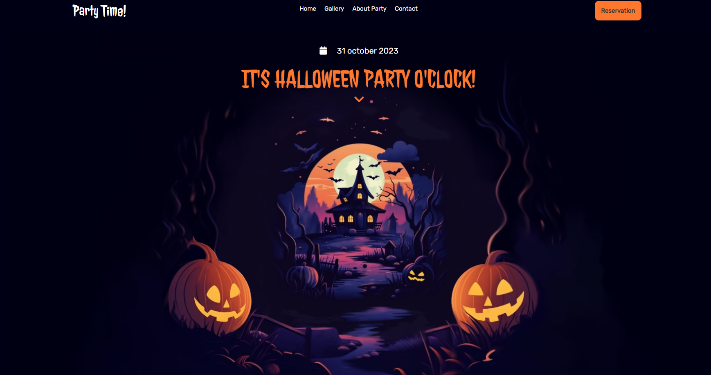
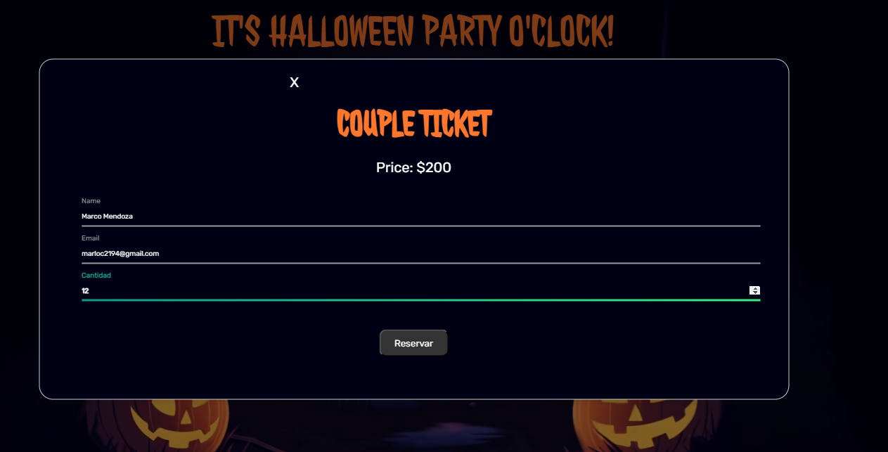
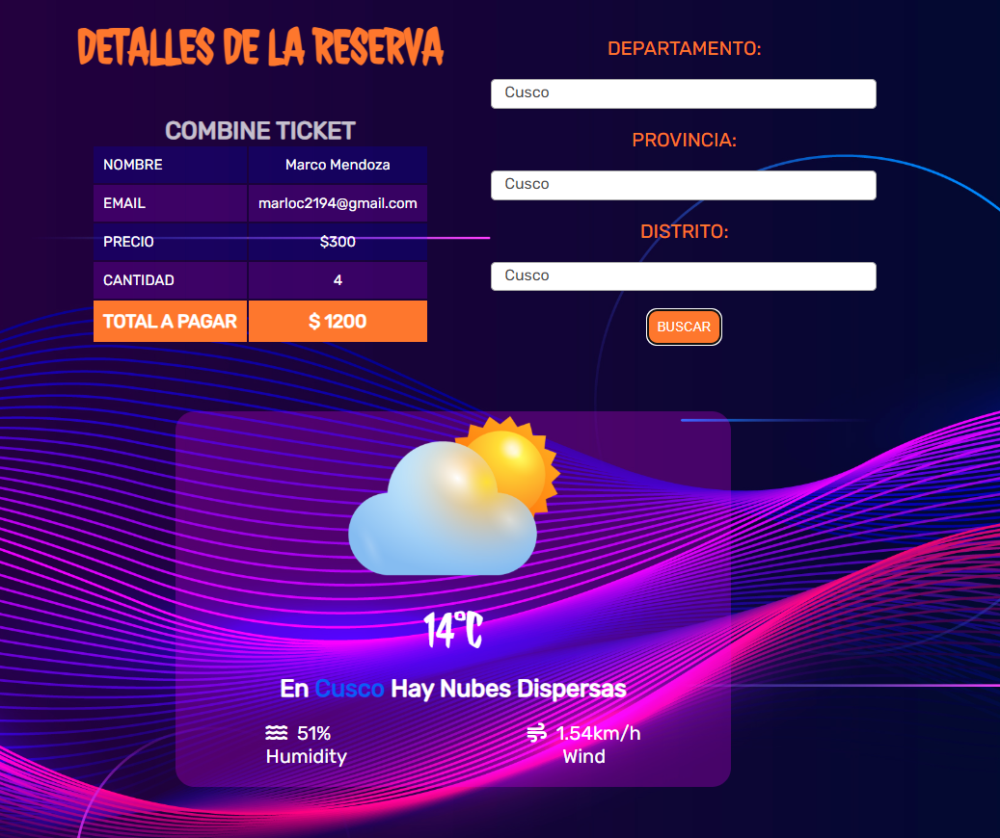

<h2 align="center">
  PARTY TIME - v2.0 
  <a href="" target="_blank">MARCO ANTONIO MENDOZA</a>
</h2>

  

 

 &nbsp;
 &nbsp;
 &nbsp;
 &nbsp;

<h3 align="center">
    🔹
    <a href="https://github.com/Xekram2194/xekram.github.io/issues">Report Bug</a> &nbsp; &nbsp;
    🔹
    <a href="https://github.com/Xekram2194/xekram.github.io/issues">Request Feature</a>
</h3>

## TL;DR

You can fork this repo to modify and make changes of your own. Please give me proper credit by linking back to [Xekram2194](https://github.com/Xekram2194/xekram.github.io). Thanks!

## Built With

Halloween page <a href="" target="_blank">Marco Mendoza</a> this page is part of a CODERHOUSE project and technical skills. 

This project was built using these technologies.

- HTML
- SASS
- Javascript
- VsCode
- Vercel

## Features

**📖 Multi-Page Layout**

**🎨 Styled with React-Bootstrap and Css with easy to customize colors**

**📱 Fully Responsive**

## Getting Started

Clone down this repository. You will need `node.js` and `git` installed globally on your machine.

## 🛠 Installation and Setup Instructions

1. Installation: `npm install`

2. In the project directory, you can run: `npm start`

Runs the app in the development mode.\
Open [http://localhost:3000](http://localhost:3000) to view it in the browser.
The page will reload if you make edits.

## Usage Instructions

Open the project folder and Navigate to `/src/components/`.  
You will find all the components used and you can edit your information accordingly.

### Show your support

Give a ⭐ if you like this website!

## Screenshots

<h3 align="center">
  <a href="" target="_blank">Form</a>
</h3>

  

 
 
<h3 align="center">
  <a href="" target="_blank">API Weather API</a>
</h3>

  

